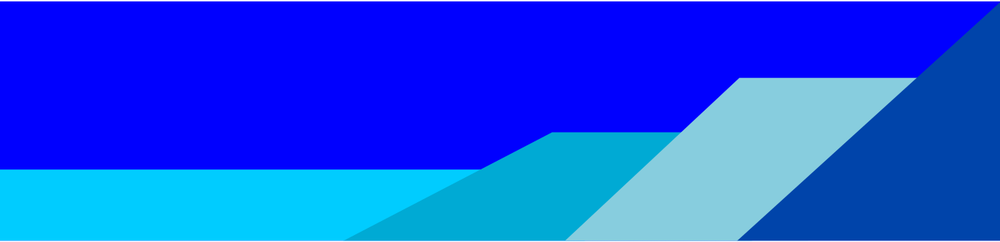

### Sobre mim

Meu nome é Katarine, Desenvolvedora Front-end desde 2016, como Freelancer. Formada em Análise e Desenvolvimento de Sistemas em 2015 e Pós-graduada em Desenvolvimento Java em 2017, na Universidade Estácio de Sá do Rio de Janeiro - RJ.

#### &#10159; Conhecimentos

* HTML 5, CSS 3 e Javascript;
* Layout, Design e Responsividade;
* Lógica de Programação;
* Wordpress (Adicionar, Modificar e Criar Temas);
* Elementor;
* React (Componentes, Props, Hooks, React Router Dom, API);
* Node JS;
* Git
* Orientação a Objetos;
* Java 8, 11 ou mais;
* JPA;
* API Rest em Java;
* Spring Boot;
* Banco de Dados Relacionais (SQL Server, MySQL, PHPMyAdmin) ;
* Design Patterns.

#### &#10159; Utilidades

* Postman.

#### &#10159; Ferramentas de Desenvolvimento

* Visual Studio Code;
* Eclipse;
* IntelliJ IDEA.

### Onde me encontrar

    
    &nbsp;
    

